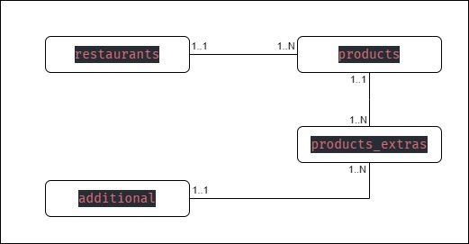

# **Banco da dados**

**`Postgres`** X MySQL

### restaurants

| field       | type         | obs |
| ----------- | ------------ | --- |
| **id**      | int          | PK  |
| name        | varchar(255) |     |
| owner       | varchar(255) |     |
| address     | varchar(255) |     |
| description | text         |     |
| image       | varchar(255) |     |

### products

| field             | type         | obs |
| ----------------- | ------------ | --- |
| **id**            | int          | PK  |
| **id_restaurant** | int          | FK  |
| name              | varchar(255) |     |
| description       | text         |     |
| price             | float(64)    |     |
| image             | varchar(255) |     |

### additional

| field  | type         | obs |
| ------ | ------------ | --- |
| **id** | int          | PK  |
| name   | varchar(255) |     |
| price  | float(64)    |     |

### products_extras

| field             | type | obs   |
| ----------------- | ---- | ----- |
| **id_product**    | int  | PK FK |
| **id_additional** | int  | PK FK |
